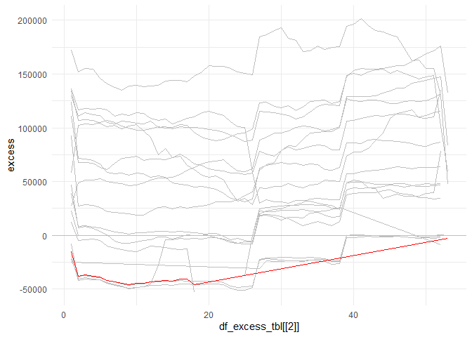
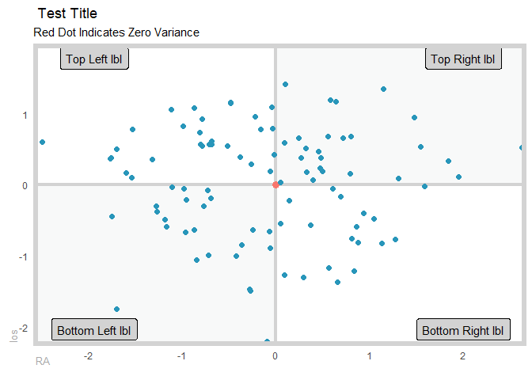

<!-- README.md is generated from README.Rmd. Please edit that file -->

# healthyR 

<!-- badges: start -->

[](https://cran.r-project.org/package=healthyR)


[](https://www.tidyverse.org/lifecycle/#experimental)
<!-- badges: end -->

The goal of healthyR is to help quickly analyze common data problems in
the Administrative and Clincial spaces.

## Installation

You can install the released version of healthyR from
[CRAN](https://CRAN.R-project.org) with:

``` r
install.packages("healthyR")
```

And the development version from [GitHub](https://github.com/) with:

``` r
# install.packages("devtools")
devtools::install_github("spsanderson/healthyR")
```

## Example

This is a basic example of using the ts\_median\_excess\_plt()
function\`:

``` r
library(healthyR)
library(timetk)

ts_ymwdh_tbl(.data = m4_daily, .date_col = date) %>%
    ts_median_excess_plt(
        .date_col = date
        , .value_col = value
        , .x_axis = wk
        , .ggplot_group_var = yr
        , .years_back = 5
    )
#> Joining, by = "wk"
```



Here is a simple example of using the ts\_ymwdh\_tbl() function:

``` r
library(healthyR)
library(timetk)

ts_ymwdh_tbl(.data = m4_daily, .date_col = date)
#> # A tibble: 9,743 x 8
#>    id    date       value    yr mn       wk wd       hr
#>    <fct> <date>     <dbl> <dbl> <ord> <dbl> <ord> <int>
#>  1 D10   2014-07-03 2076.  2014 Jul      27 Thu       0
#>  2 D10   2014-07-04 2073.  2014 Jul      27 Fri       0
#>  3 D10   2014-07-05 2049.  2014 Jul      27 Sat       0
#>  4 D10   2014-07-06 2049.  2014 Jul      27 Sun       0
#>  5 D10   2014-07-07 2006.  2014 Jul      28 Mon       0
#>  6 D10   2014-07-08 2018.  2014 Jul      28 Tue       0
#>  7 D10   2014-07-09 2019.  2014 Jul      28 Wed       0
#>  8 D10   2014-07-10 2007.  2014 Jul      28 Thu       0
#>  9 D10   2014-07-11 2010   2014 Jul      28 Fri       0
#> 10 D10   2014-07-12 2002.  2014 Jul      28 Sat       0
#> # ... with 9,733 more rows
```

Here is a simple example of using the plt\_gartner\_magic\_chart()
function:

``` r
suppressPackageStartupMessages(library(healthyR))
suppressPackageStartupMessages(library(tibble))
suppressPackageStartupMessages(library(dplyr))

gartner_magic_chart_plt(
  .data = tibble(x = rnorm(100, 0, 1), y = rnorm(100, 0, 1))
  , .x_col = x
  , .y_col = y
  , .y_lab = "los"
  , .x_lab = "RA"
  , .plt_title = "Test Title"
  , .tl_lbl = "Top Left lbl"
  , .tr_lbl = "Top Right lbl"
  , .bl_lbl = "Bottom Left lbl"
  , .br_lbl = "Bottom Right lbl"
)
```


