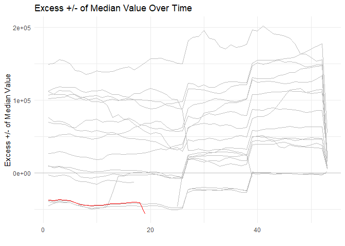
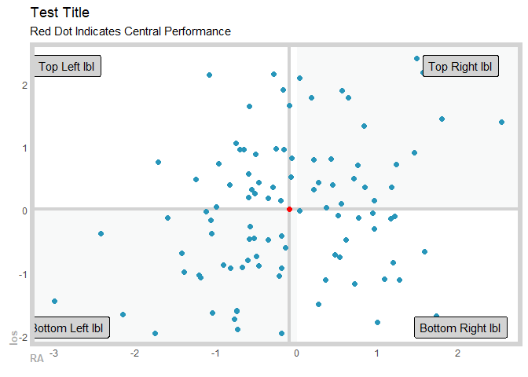

<!-- README.md is generated from README.Rmd. Please edit that file -->

# healthyR 

<!-- badges: start -->

[](https://cran.r-project.org/package=healthyR)


[](https://lifecycle.r-lib.org/articles/stages.html##experimental)
[](https://makeapullrequest.com)
<!-- badges: end -->

## Overview

To view the full wiki, click here: [Full healthyR
Wiki](https://github.com/spsanderson/healthyR/blob/master/wiki/README.md)

**healthyR** is a comprehensive R package designed to streamline
hospital data analysis workflows. It provides a consistent, intuitive
framework for analyzing common administrative and clinical data
problems, helping healthcare analysts and data scientists quickly
generate insights from hospital data.

### Key Features

- **📊 Time Series Analysis**: Advanced tools for analyzing hospital
  census, length of stay (LOS), readmission rates, and other temporal
  metrics
- **📈 Visualization**: Ready-to-use plotting functions for common
  healthcare analytics use cases
- **🏥 Service Line Grouping**: Automated patient classification into
  service lines based on ICD-10 codes and DRG
- **📉 Performance Metrics**: Calculate and visualize key hospital
  performance indicators including ALOS (Average Length of Stay),
  readmission rates, and LOS/Readmit indices
- **🎨 Accessible Design**: Color-blind friendly palettes and themes for
  inclusive data visualization
- **🔧 Utility Functions**: Helper functions for data manipulation,
  Excel export, and SQL-style string operations

### What Problems Does healthyR Solve?

healthyR takes the guesswork out of common hospital data analysis tasks:

- Calculate average length of stay across different time periods and
  patient populations
- Analyze readmission rates and identify trends
- Create service line classifications from diagnosis and procedure codes
- Generate publication-ready visualizations of hospital metrics
- Perform census and capacity planning analyses
- Identify outliers and excess utilization patterns

## Installation

You can install the released version of healthyR from
[CRAN](https://CRAN.R-project.org) with:

``` r
install.packages("healthyR")
```

And the development version from [GitHub](https://github.com/) with:

``` r
# install.packages("devtools")
devtools::install_github("spsanderson/healthyR")
```

## Quick Start

``` r
library(healthyR)
library(dplyr)
library(timetk)

# Load your hospital data
# Analyze time series patterns with time signatures
data_with_time_features <- ts_signature_tbl(
  .data = your_data, 
  .date_col = admission_date
)

# Visualize average length of stay trends
ts_alos_plt(
  .data = your_data,
  .date_col = discharge_date,
  .value_col = length_of_stay,
  .by_grouping = "month"
)

# Create service line classifications
data_with_service_line <- your_data %>%
  mutate(
    service_line = service_line_vec(
      .data = .,
      .dx_col = principal_dx,
      .px_col = principal_px,
      .drg_col = drg_number
    )
  )
```

## Core Functionality

### Time Series Analysis

healthyR provides powerful tools for temporal analysis of hospital data.

#### Time Signature Features

Add time-based features to your data for advanced analysis:

``` r
library(healthyR)
library(timetk)

ts_signature_tbl(.data = m4_daily, .date_col = date)
#> # A tibble: 17,578 × 31
#>    id    date       value index.num  diff  year year.iso  half quarter month
#>    <fct> <date>     <dbl>     <dbl> <dbl> <int>    <int> <int>   <int> <int>
#>  1 D410  1978-06-23 9109. 267408000    NA  1978     1978     1       2     6
#>  2 D410  1978-06-24 9103. 267494400 86400  1978     1978     1       2     6
#>  3 D410  1978-06-25 9116. 267580800 86400  1978     1978     1       2     6
#>  4 D410  1978-06-26 9116. 267667200 86400  1978     1978     1       2     6
#>  5 D410  1978-06-27 9106. 267753600 86400  1978     1978     1       2     6
#>  6 D410  1978-06-28 9094. 267840000 86400  1978     1978     1       2     6
#>  7 D410  1978-06-29 9094. 267926400 86400  1978     1978     1       2     6
#>  8 D410  1978-06-30 9084. 268012800 86400  1978     1978     1       2     6
#>  9 D410  1978-07-01 9081. 268099200 86400  1978     1978     2       3     7
#> 10 D410  1978-07-02 9047. 268185600 86400  1978     1978     2       3     7
#> # ℹ 17,568 more rows
#> # ℹ 21 more variables: month.xts <int>, month.lbl <ord>, day <int>, hour <int>,
#> #   minute <int>, second <int>, hour12 <int>, am.pm <int>, wday <int>,
#> #   wday.xts <int>, wday.lbl <ord>, mday <int>, qday <int>, yday <int>,
#> #   mweek <int>, week <int>, week.iso <int>, week2 <int>, week3 <int>,
#> #   week4 <int>, mday7 <int>
```

#### Median Excess Visualization

Identify patterns and outliers in time series data:

``` r
library(healthyR)
library(timetk)
library(dplyr)

ts_signature_tbl(.data = m4_daily, .date_col = date, .pad_time = TRUE, id) %>%
    ts_median_excess_plt(
        .date_col           = date
        , .value_col        = value
        , .x_axis           = week
        , .ggplot_group_var = year
        , .years_back       = 5
    )
```



### Visualization Tools

#### Gartner Magic Chart

Create quadrant charts for performance analysis (e.g., comparing length
of stay vs readmission risk):

``` r
suppressPackageStartupMessages(library(healthyR))
suppressPackageStartupMessages(library(tibble))
suppressPackageStartupMessages(library(dplyr))

gartner_magic_chart_plt(
  .data = tibble(x = rnorm(100, 0, 1), y = rnorm(100, 0, 1))
  , .x_col = x
  , .y_col = y
  , .y_lab = "los"
  , .x_lab = "RA"
  , .plot_title = "Test Title"
  , .top_left_label = "Top Left lbl"
  , .top_right_label = "Top Right lbl"
  , .bottom_left_label = "Bottom Left lbl"
  , .bottom_right_label = "Bottom Right lbl"
)
```



### Service Line Analysis

Automatically classify patients into service lines based on clinical
codes:

``` r
# Example: Classify patients by service line
df <- data.frame(
  dx_col = "F10.10",  # ICD-10 diagnosis code
  px_col = NA,         # Procedure code (if applicable)
  drg_col = "896"      # DRG number
)

service_line_vec(
  .data = df,
  .dx_col = dx_col,
  .px_col = px_col,
  .drg_col = drg_col
)
```

## Function Categories

### 📊 Time Series & Plotting Functions

- `ts_signature_tbl()` - Add time-based features to your data
- `ts_alos_plt()` - Plot average length of stay over time
- `ts_readmit_rate_plt()` - Visualize readmission rates
- `ts_median_excess_plt()` - Identify excess utilization patterns
- `ts_census_los_daily_tbl()` - Calculate daily census and LOS metrics
- `ts_plt()` - General time series plotting

### 📈 Performance Metrics

- `los_ra_index_summary_tbl()` - Calculate LOS and readmission indices
- `los_ra_index_plt()` - Visualize performance indices
- `gartner_magic_chart_plt()` - Create quadrant performance charts
- `diverging_bar_plt()` - Show positive/negative deviations
- `diverging_lollipop_plt()` - Lollipop charts for variance analysis

### 🏥 Data Transformation Functions

- `service_line_vec()` - Classify patients into service lines
- `service_line_augment()` - Add service line column to your data
- `category_counts_tbl()` - Get frequency counts by category
- `top_n_tbl()` - Extract top N records by criteria
- `named_item_list()` - Create named lists for Excel export

### 🎨 Accessibility Features

- `color_blind()` - Color-blind friendly palette
- `hr_scale_fill_colorblind()` - ggplot2 fill scale for accessibility
- `hr_scale_color_colorblind()` - ggplot2 color scale for accessibility

### 🔧 Utility Functions

- `save_to_excel()` - Export data to Excel with timestamp
- `opt_bin()` - Calculate optimal bin size for histograms
- `sql_left()`, `sql_right()`, `sql_mid()` - SQL-style string operations

## Documentation

- [📚 Function
  Reference](https://www.spsanderson.com/healthyR/reference/index.html) -
  Complete documentation of all functions
- [🚀 Getting Started
  Vignette](https://www.spsanderson.com/healthyR/articles/getting-started.html) -
  Detailed introduction and tutorials
- [📰 News &
  Changelog](https://www.spsanderson.com/healthyR/news/index.html) -
  Latest updates and changes

## Data Included

healthyR includes reference datasets for service line classification:

- `dx_cc_mapping` - ICD-10 diagnosis code mappings for condition
  categories
- `px_cc_mapping` - ICD-10 procedure code mappings for procedure
  categories

## Contributing

We welcome contributions! Please see our [Contributing
Guidelines](CODE_OF_CONDUCT.md) for details on:

- Reporting bugs
- Suggesting new features
- Submitting pull requests
- Code of conduct

## Getting Help

If you encounter issues or have questions:

1.  Check the [function
    documentation](https://www.spsanderson.com/healthyR/reference/index.html)
2.  Review the [Getting Started
    vignette](https://www.spsanderson.com/healthyR/articles/getting-started.html)
3.  Search [existing
    issues](https://github.com/spsanderson/healthyR/issues)
4.  Open a [new
    issue](https://github.com/spsanderson/healthyR/issues/new) with a
    reproducible example

## Citation

If you use healthyR in your research or publications, please cite it:

``` r
citation("healthyR")
```

## License

MIT © Steven P. Sanderson II, MPH

## Author

**Steven P. Sanderson II, MPH** - Website:
<https://www.spsanderson.com> - GitHub:
[@spsanderson](https://github.com/spsanderson) - ORCID:
[0009-0006-7661-8247](https://orcid.org/0009-0006-7661-8247)
