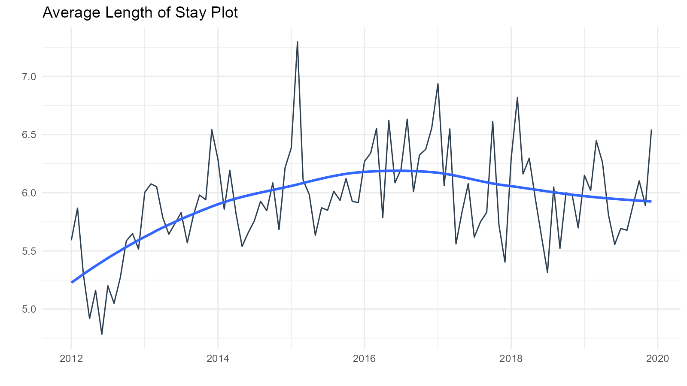

# Getting Started with healthyR

> healthyR: A toolkit for hospital data

## Libaray Load

First things first, lets load in the library:

``` r
library(healthyR)
library(healthyR.data)
library(timetk)
library(dplyr)
library(purrr)
```

## Generate Sample Data

First we are going to take a look at some time series plotting
functions. These are fairly straight forward and therefore should seem
intuitive. We are going to generate some random numbers to simulate
different daily average length of stay data. We will set a seed for
reproducibility.

``` r
# Get Length of Stay Data
data_tbl <- healthyR_data

df_tbl <- data_tbl %>%
  filter(ip_op_flag == "I") %>%
  select(visit_end_date_time, length_of_stay) %>%
  summarise_by_time(
    .date_var = visit_end_date_time
    , .by     = "day"
    , visits  = mean(length_of_stay, na.rm = TRUE)
  ) %>%
  filter_by_time(
    .date_var     = visit_end_date_time
    , .start_date = "2012"
    , .end_date   = "2019"
  ) %>%
  set_names("Date","Values")
```

## Plot the Time Series

Now that we have our data lets see how easy it is to generate an ALOS
chart:

``` r
ts_alos_plt(
  .data = df_tbl
  , .date_col = Date
  , .value_col = Values
  , .by = "month"
  , .interactive = FALSE
)
```



And with the `.interactive` option set to **TRUE**:

``` r
ts_alos_plt(
  .data = df_tbl
  , .date_col = Date
  , .value_col = Values
  , .by = "month"
  , .interactive = TRUE
)
```

As we can see, this function has the ability to return either a static
plot or and interactive plot. Under the hood it is using the
[`timetk::plot_time_series`](https://business-science.github.io/timetk/reference/plot_time_series.html)
function. You can find out more on the the timetk function
[here.](https://business-science.github.io/timetk/reference/plot_time_series.html)

That is the end of this first and very quick tutorial on the
`ts_alos_plt` function.
